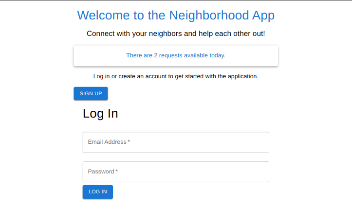
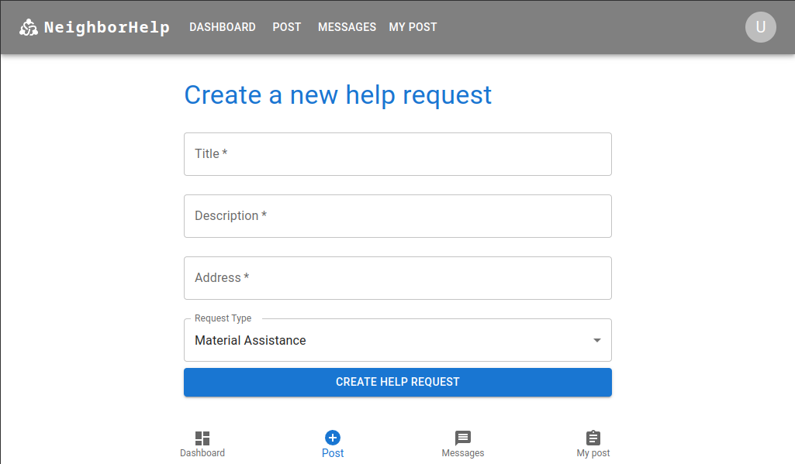
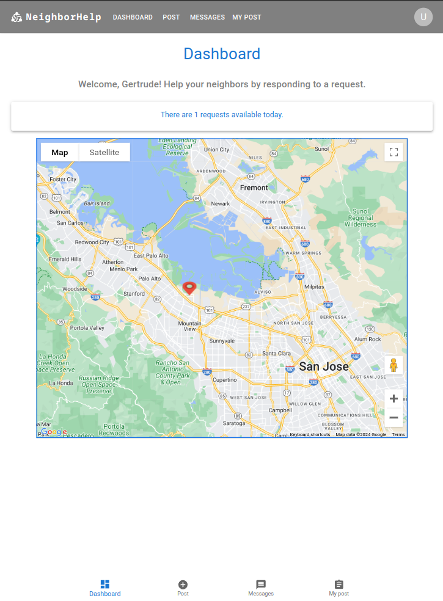

# Neighborhood App

## Overview
The Aid Platform project aims to connect people in need with willing volunteers within the community. It facilitates acts of kindness by enabling users to request assistance and volunteer to help others in their local area.

## Built With
- Ruby v2.7.2
- Ruby on Rails v6.1.0
- PostgreSQL
- React v17.0.2
- Google Maps API
- MUI (formerly Material-UI) for UI components

## Getting Started
To get a local copy up and running, follow these simple steps:

### Initial Setup
1. Clone this repository with `git clone https://github.com/MagaliFabre/neighborhood_app.git` using your terminal or command line.
2. Change to the project directory by entering `cd neighborhood_app` in the terminal.
3. Navigate to the `ruby` directory for the Rails backend, and follow the setup instructions in the README.md file.
4. Navigate to the `Frontend_react` directory for the React frontend, and follow the setup instructions in the README.md file.

## Features
- Users can sign up and create accounts with their name, email address and password.
- Real-time tracking of assistance requests and volunteer locations using Google Maps API.
- Differentiates between one-time tasks and material needs with colored markers on the map.
- Allows users to click on markers to view request details and volunteer to fulfill the need.
- Message flow for communication between volunteers and requesters to coordinate assistance.
- Automatic removal of requests from the map after at least volunteers have committed or after 24 hours if not fulfilled.
- Counter displaying the number of unfulfilled help requests on the homepage.

## Usage
1. Start the Rails server by running `rails server` in the `ruby` directory.
2. Start the React development server by running `npm start` in the `Frontend_react` directory.
3. Open [http://localhost:3000/](http://localhost:3000/) in your browser to view the Aid Platform application.

## Deployment
The Aid Platform can be deployed online. Follow these steps to deploy using Docker on a personal server:

### Docker Deployment
1. Ensure Docker is installed on your server. Follow the instructions [here](https://docs.docker.com/get-docker/).
2. Clone this repository with `git clone https://github.com/MagaliFabre/neighborhood_app.git`.
3. Navigate to the project directory by entering `cd neighborhood_app` in the terminal.
4. Build the Docker images for both the backend and frontend:
    ```sh
    docker-compose build
    ```
5. Start the containers:
    ```sh
    docker-compose up
    ```
6. Your application should now be running on your personal server. Open your server's IP address in your browser to view the application. For example, [http://server.gr1moire.net/](http://server.gr1moire.net/).

## Database Schema


## Screenshots
### Home Page


### Submission Form


### Google Maps Integration


## Authors
Magali Fabre

## Acknowledgments
- Google Maps API
- MUI (formerly Material-UI)

## License
This project is licensed under the MIT License.

## Project Debrief

### Technology and Purpose

Technology is best used to help people, whether globally or right outside your door! This project aims to build a platform to facilitate acts of kindness.

### Functionality

#### Accounts

- Users can sign up with their name, email address and password.

#### Volunteering to Help

- Signed-in users see a map with markers indicating people in need of community help.
- Markers are colored differently for one-time tasks and material needs.
- The map refreshes results based on the user's location and allows movement.
- Clicking a marker shows request details and a button to volunteer.
- Users can send messages directly to requesters to organize fulfillment.
- Requests disappear from the map after at least 1 volunteers or if marked as fulfilled.

#### Submitting a Request

- Users can submit requests with a brief description, type of request, and location.
- Requests have a status of fulfilled or unfulfilled, defaulting to unfulfilled.

#### Counter

- A counter displays the number of unfulfilled help requests, updating every few seconds without reloading the page.

### Technicalities

- Built with Ruby on Rails for the backend and React for the frontend.
- Includes tests for the code.
- Deployed live on the web.
- Responsive design for mobile and tablet views.

### Deliverables

- Finished codebase
- At least 5 wireframes
- Link to the deployed website

### Presentation

- An oral presentation of the project with an assessor.

### Skills Evaluated

- Deploy Rails apps
- Design wireframes for web or mobile
- Create a Rails app

This project demonstrates the ability to build a robust web application that connects people in need with willing volunteers, addressing real-world problems through technology.
